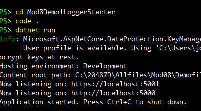
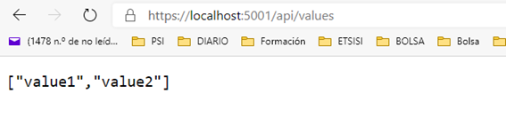

Module 8: Monitoring and Diagnostics

\# Lesson 1: Logging in ASP.NET Core

 

\### Demonstration: Recording logs to the Console and EventSource providers

 

\#### Demonstration Steps

 

 

 

 

 

 

 

 

 

 